# Getting started with PoseCap

By the end of this page a 3D character in Blender moves live with a person on
your webcam — no mocap suit, no markers. It takes about 20 minutes, and most of
that is downloads you can leave running.

This is the **complete, do-it-once path**. Follow it top to bottom; every step is
here, so you never have to leave and come back. (Want depth on one feature later?
Each step links a focused guide at the end.)

> **One thing to know up front.** PoseCap offers two capture backends. **MediaPipe
> Lite** is the recommended first run: it needs no NVIDIA GPU, provider account, or
> licensed body-model download. **PEAR** is the higher-fidelity NVIDIA path and uses
> SMPL-family models licensed separately by the Max Planck Institute. Only PEAR
> users need the optional account and body-model step below.

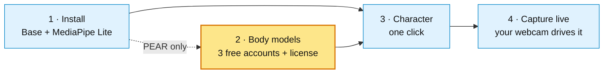

<sub>The MediaPipe Lite path skips step 2 entirely. PEAR users complete its one-time,
free licensing sign-up; everything else is one click or fully automatic.</sub>

## What you need

| | |
|---|---|
| **OS** | Windows 10 or 11 |
| **MediaPipe Lite** | CPU-first body capture; no GPU or model-provider account required |
| **PEAR** | NVIDIA/CUDA; qualified on an RTX 3080. The current runtime does not support RTX 50-series GPUs |
| **Blender** | 4.2 LTS or newer (5.x supported) — install it first from [blender.org](https://www.blender.org/download/) |
| **Camera** | Any webcam, or a video file to test with |

## 1. Install PoseCap

Download the latest `PoseCap_..._Windows_Setup.exe` from the
[releases page](https://github.com/CorridorTech/PoseCap/releases/latest). PoseCap
does not buy an Authenticode certificate for its open-source installer, so
Microsoft Defender SmartScreen may show **Windows protected your PC**. This is an
expected warning for the unsigned installer, not a reason to disable Windows
security.

Before running it, download the matching `.sha256` file from the same release and
compare the published value in PowerShell:

```powershell
$installer = Get-Item .\PoseCap_*_Windows_Setup.exe
Get-FileHash -Algorithm SHA256 -LiteralPath $installer.FullName
Get-Content -LiteralPath "$($installer.FullName).sha256"
```

The two hashes must match. If you use the GitHub CLI, you can also verify that the
installer was built by this repository's protected release workflow:

```powershell
gh attestation verify $installer.FullName --repo CorridorTech/PoseCap
```

Only after the download verifies, open it. If SmartScreen appears, select **More
info** and then **Run anyway**. Managed company computers may prohibit unsigned
applications entirely; in that case, follow your organization's security policy.
The installer needs **no administrator rights** and installs into your user folder.

Click through the wizard: **Accept** the license → keep the default **destination**
→ choose **Base + MediaPipe Lite** for the recommended account-free path →
**Install**. Select PEAR as well only when you want its NVIDIA workflow and accept
the separate model-license setup in step 2. PEAR adds the long **~5 GB** GPU-runtime
download; MediaPipe Lite is the smaller CPU path. When setup completes, click
**Finish**.

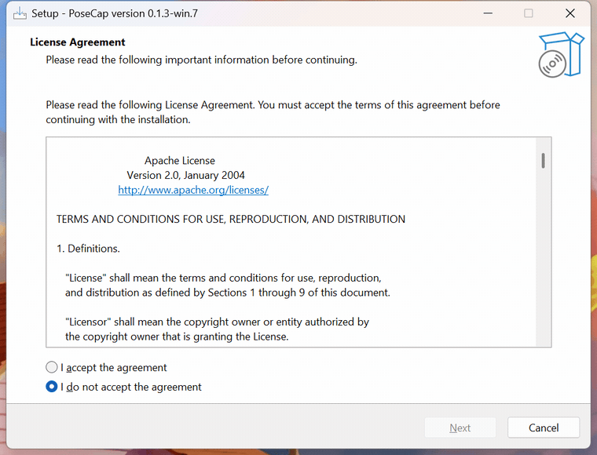

PoseCap also installs its panel into Blender for you. That is the whole install —
no files to place, no paths to set.

> Nothing licensed is downloaded here. The body models are the next step, done
> with your own account.

## 2. Optional: get the PEAR body models

**If you selected MediaPipe Lite, skip to step 3.** Nothing in this section is
required for the account-free backend.

PEAR users should slow down here. This is a **one-time, free** setup of the SMPL-X
research body models. Because they are licensed (see the note at the top), you
create the accounts; PoseCap does the downloading, unzipping, and installing — no
files to find or move.

Total time: about five minutes, plus a ~500 MB download.

### 2a. Create your three free accounts (this *is* the license step)

Register on each of the three official sites, using the **same email and password
on all three** (that keeps the next part to a single login):

| Site | Register |
|---|---|
| SMPL | <https://smpl.is.tue.mpg.de/register.php> |
| SMPL-X | <https://smpl-x.is.tue.mpg.de/register.php> |
| FLAME | <https://flame.is.tue.mpg.de/register.php> |

On each form, enter your email, pick a password (**at least 8 characters**), and
**turn every license toggle green**. Flipping those toggles on **is** the license
acceptance — there is nothing else to sign; you can leave *Receive Emails* off.
The toggles differ slightly per site:

**SMPL** — *Accept terms* + *Accept license*:

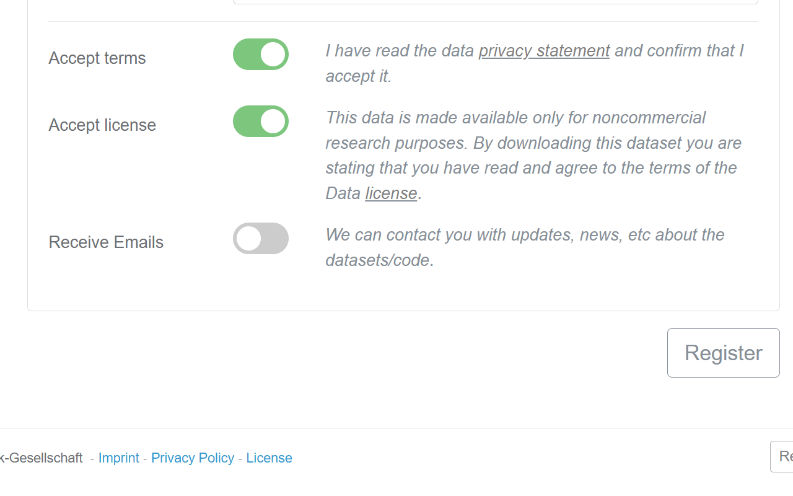

**SMPL-X** — *Accept terms* + *Accept model license* + *Accept body license*:

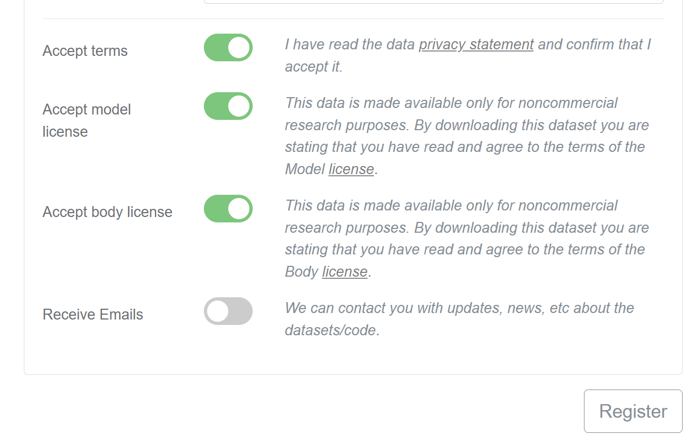

**FLAME** — *Accept terms* + *Accept model license* + *Accept data license*:

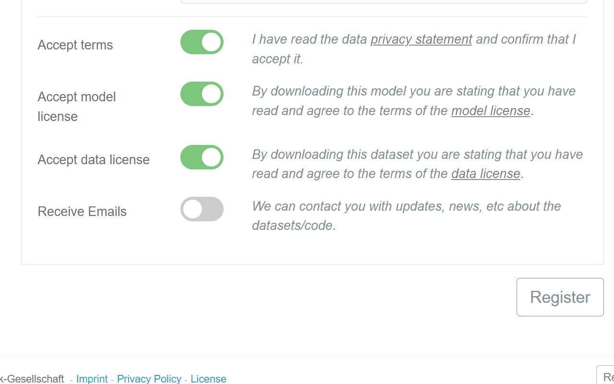

All three are required — PoseCap needs one file from each (SMPL, SMPL-X, and the
FLAME head model that SMPL-X uses).

### 2b. Confirm your email — check your spam folder

Each site emails you a verification link that **must be clicked before downloads
work**. That mail very often lands in **spam/junk** — look for it there, open it,
and click **Confirm my account**:

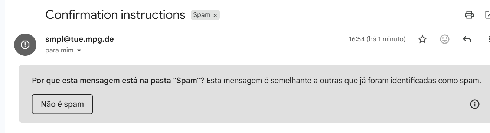

An unconfirmed account is the usual reason a download later fails with a login
error, so don't skip this.

### 2c. Let PoseCap download and install everything

Open Blender. In the 3D Viewport press **`N`** to open the sidebar, then click the
**PoseCap** tab. You will see the **Getting Started with PoseCap** checklist, with
capture disabled until it is complete — so you can never click into an error:

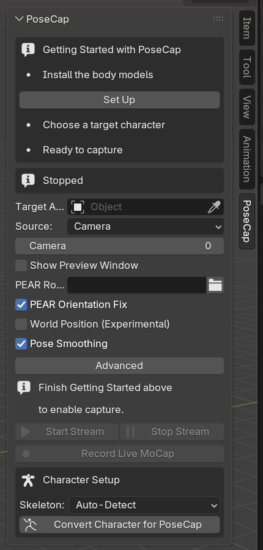

Click **Set Up** on the first row. Enter the **email and password** from step 2a
and click **OK**:

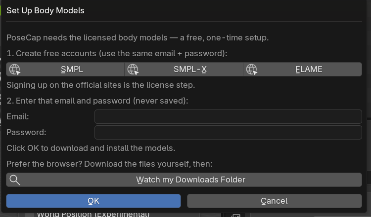

Your password is used once, in memory, to download from the official server — it
is never saved or logged, and the field clears the moment the download starts. A
progress bar shows each file as it lands:

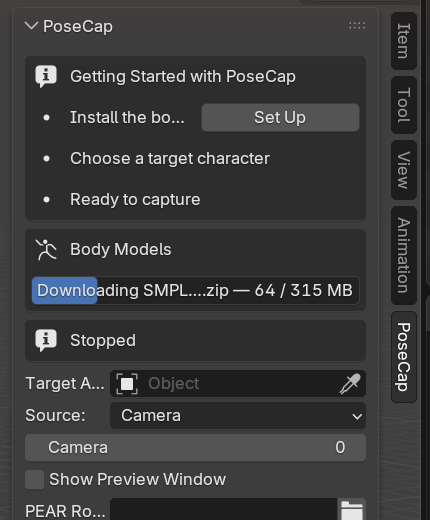

When every file is in, the first checklist row turns to a green tick.

> Don't want to type your password into Blender? The same dialog has a **Watch my
> Downloads Folder** option — download the three files yourself in a browser and
> PoseCap picks them up. Full details and troubleshooting: the
> [body-models guide](smplx-model-setup.md).

## 3. Set up a character

Bring in any **Mixamo** or **Unreal Engine** character (or use the built-in SMPL-X
body): **File → Import → FBX**. It will import small and lying on its side — that
is normal, the next click fixes it.

In the PoseCap panel, pick your character's armature as the **Target Armature**,
leave **Skeleton** on **Auto-Detect**, and click **Convert Character for PoseCap**.
One click reorients and renames the skeleton, then self-checks its work
(*"Character converted (Mixamo) — probe error 0.0000"*):

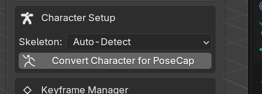

Full walkthrough, including custom skeletons: the
[character-setup guide](character-setup.md).

## 4. Capture it live

The payoff. Pick your **Source** — a **webcam**, or a **video file** to test with
(a clip loops, so your character keeps moving) — turn on **Show Preview Window**,
and click **Start Stream**.

> **The first Start Stream takes a moment.** The AI model was already downloaded
> during install, so the very first start just warms up the engine — a cold load
> can take a minute or two. If the panel says *"Still starting…"*, that is the
> warmup, not a freeze; leave it running. Every later start is immediate.

Once frames arrive, your character moves with the person in the source, in real
time. Turn on **Record Live MoCap** to bake the motion onto the timeline as
keyframes.

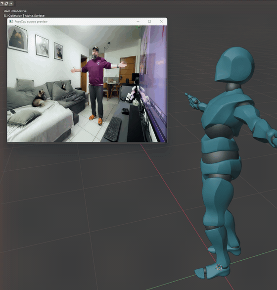

Full options — smoothing, per-limb filters, and the **Camera Pitch** control that
keeps a tilted-camera capture upright: the [live-capture guide](live-capture.md).

---

That is the whole pipeline: **install → models → character → live capture.** You
now have a character you can drive from any webcam.

**Go deeper, per feature:**

- [Set up the body models](smplx-model-setup.md) — the licensed download, the Watch-Downloads option, and troubleshooting.
- [Set up a character](character-setup.md) — Mixamo, Unreal, and custom-skeleton mapping.
- [Live capture](live-capture.md) — source options, recording, smoothing, and camera tilt.

Any time you want to confirm your setup is healthy, run the Doctor for your selected
backend from **Start Menu → PoseCap**. Every check for that backend should be green.
