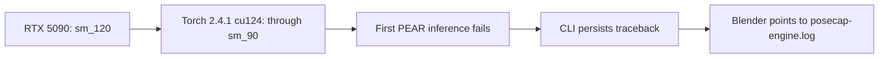
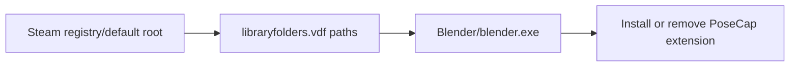

# Task `0026`: Qualify GUI release backends

**Status:** in-progress
**Created:** 2026-07-14
**Owner:** alexandremendoncaalvaro
**Execution:** HITL
**Spec ref:** doc/specs/0003-select-windows-backend-modules.md
**Board ref:**

## Context

The tutorial and public installer need a release candidate that an animator can use
without terminal intervention. Source and fixture acceptance already prove much of
the implementation, but they do not prove the actual Windows setup screens, a
user-provided Mixamo import, live camera behavior, or the licensed PEAR asset gate.
This task qualifies one frozen installer candidate through those real user journeys
for MediaPipe Lite and PEAR before it is presented as tutorial-ready.

## Acceptance Criteria

- [ ] One versioned installer candidate containing Base, MediaPipe Lite, and PEAR is
  built from a green source revision; its SHA-256 and selected component manifests
  are recorded before GUI qualification begins.
- [ ] From a clean PoseCap and Blender-extension state, the GUI installer selects
  only Base plus MediaPipe Lite, reaches a ready addon panel without a terminal, and
  records a ready MediaPipe doctor and installed-component inventory.
- [ ] In Blender's graphical interface, a user-provided Mixamo FBX is imported,
  converted, and visibly follows a live MediaPipe camera capture in body bones.
- [ ] From a separate clean state, the GUI installer selects Base plus PEAR; after
  the license holder supplies the official user-owned assets, PEAR doctor is fully
  ready and the GUI reaches a ready PEAR addon panel without a terminal.
- [ ] In Blender's graphical interface, a user-provided full-hand Mixamo FBX is
  imported, converted, and visibly follows live PEAR capture in body bones and at
  least two distinguishable left/right finger poses.
- [ ] A fresh state installs both optional components, the addon exposes each as
  ready, and switching the selector launches the selected backend without changing
  the other component's inventory or doctor result.
- [ ] Every failed or corrected journey is restarted at its first clean-install
  step; the final report retains screenshots or recording, doctor JSON, installed
  inventory, addon log, installer hash, elapsed duration, and pass/fail result for
  each journey.

## Plan

- [ ] Freeze and build the candidate after the local quality gate; record hash,
  payload manifests, expected installer screens, and rollback location.
- [ ] Prepare an authorized Mixamo FBX and a clean application state that contains
  no PoseCap files or Blender extension; verify the test camera is visible to the
  Windows session.
- [ ] Drive the MediaPipe-only GUI journey: installer selection, doctor, Blender
  import/conversion, live preview, body-motion observation, clean stop, and evidence
  collection.
- [ ] Restore the clean state and drive the PEAR GUI journey. Pause only at the
  license-holder acceptance and official asset-acquisition boundary; then validate
  doctor, Blender import/conversion, live body motion, and separate finger motion.
- [ ] Restore the clean state once more, install both components, switch backends in
  the addon, and verify component isolation with inventories and doctors.
- [ ] If a journey exposes a defect, add its failing acceptance test, apply the
  smallest fix, rerun the full affected journey from clean state, then run the full
  local gate and fresh-context review before closing the task.

## Notes

Append-only log. Date each entry. Never rewrite past entries.

### 2026-07-14

The release-validation protocol follows Google SRE canary principles: freeze one
candidate, evaluate a small representative journey with observable user signals, and
only advance after its result is good. It adapts the population split into separate
clean-state journeys for the account-free and licensed backends. Full GUI testing is
deliberately on real Windows, consistent with the Inno-based ESP-IDF installer
reference; source tests remain a fast preceding gate, not a substitute for setup
screens and Blender interaction.

MediaPipe success is scoped to its declared body capability. PEAR success additionally
requires official user-owned SMPL, SMPL-X, and FLAME assets and visible finger motion;
neither asset acceptance nor commercial licensing is automated or accepted by this
task on behalf of the license holder. Any correction invalidates the affected journey
and requires a fresh complete rerun rather than a midstream patch-and-continue.

### 2026-07-14

The frozen candidate can be qualified without publication. Task 0023 already
exercised Inno's real external-download, hash, extraction, bootstrap, and Blender
extension flow against a loopback HTTP server; its captured script and evidence live
under ignored `packaging/work/e2e-ui-pear-v2/`. This task reuses that pre-publication
seam for the current candidate while retaining the production renderer's HTTPS-only
manifest validation as a separate packaging gate. This is a test-host substitution,
not a claim that the release CDN has been validated.

### 2026-07-14

The final clean Windows qualification selected Base, MediaPipe Lite, and PEAR in the
same GUI installer candidate. The local-only candidate was
`PoseCap_Local_Qualification_Full_Win12_Setup.exe`, SHA-256
`7587100CFD04DEBCF0DAB1E716B76284109F3B4E76D27F0356069291D1D166B0`.
Both the application-data root and Blender user-resource root were empty before
setup and isolated under `packaging/work/release-qualification/`; the resulting
registry contained both component manifests and the isolated Blender extension.

In Blender, the GUI removed the default cube, imported
`C:\\Users\\alexa\\Downloads\\Y Bot.fbx`, converted the Mixamo armature, selected
MediaPipe Lite, and streamed `C:\\Users\\alexa\\Downloads\\Ale-PoseCAp.mp4` with the
source-preview window visible. Two distinct observed poses moved the converted body
armature. The isolated engine log recorded 17.74--23.00 FPS. The screen recording is
`C:\\Users\\alexa\\Videos\\PoseCap-e2e-final-win12-2026-07-14.mp4` (384.97 seconds,
38,274,928 bytes, verified by `ffprobe`).

The installer also registered PEAR and its doctor verified the Python runtime,
PyTorch CUDA, GPU visibility, pinned PEAR checkout, imports, and pinned weights.
It correctly stopped at the deliberate license boundary: the official user-owned
SMPL, SMPL-X, and FLAME asset files are absent from this clean state. Therefore the
PEAR live and finger acceptance criteria remain open; no license acceptance or asset
acquisition was performed on the user's behalf.

A GUI regression found during qualification had disabled Start Stream for MediaPipe
when PEAR body models were absent. A public-operator regression test drove the
smallest fix: enablement now resolves the selected backend before applying its setup
requirements. The extension was rebuilt and the complete installer-to-stream journey
was restarted from a fresh state after that correction. The local quality gate,
Blender background smoke with the real Y Bot, and fresh-context review completed
without findings. The task remains in progress because its PEAR asset-gated journey
is intentionally not complete.

### 2026-07-14

The protected release workflow now follows the modular installer contract before
creating its GitHub Release. From the signed tag it builds the PEAR and MediaPipe
bootstrap archives, renders the installer from their checked manifests, and assigns
their immutable public URLs under that same release tag. Installer, extension,
payload archives, manifests, and SHA-256 sidecars are attested and retained together.
The workflow creates a draft, confirms that every built asset is present, then makes
the release public. This follows GitHub's release-asset URL contract and the GitHub
CLI's public deployment workflow: [GitHub release assets](https://docs.github.com/en/rest/releases/assets?apiVersion=2026-03-10) and [GitHub CLI deployment](https://github.com/cli/cli/blob/trunk/.github/workflows/deployment.yml#L422-L445).

The increment was driven by the repository-governance release test: the new
assertions failed before the payload build and draft verification existed, then
passed together with actionlint, Ruff formatting, secret scanning, and the
licensed-binary guard. The local qualification executable remains local-only; it
cannot become a public release artifact because its payload URLs point to loopback.
The PEAR live/finger journey and a signed-tag run from `main` remain required before
this task can close or a full release can be claimed.

Remote release history was also inspected. The GitHub Releases `v1.0.2-win.1`
through `v1.0.5-win.1` exist, but their corresponding protected `Release` workflow
runs were each cancelled before any job step executed. They therefore provide no
evidence that the protected Windows/CUDA runner, Authenticode certificate, or the
current workflow can build and publish a release. A successful signed-tag run is a
separate release gate, not an assumed property of those older assets.

### 2026-07-14

GitHub issue [#49](https://github.com/CorridorTech/PoseCap/issues/49) supplied a
PoseCap 1.0.5 support bundle from a GeForce RTX 5090. The bundled runtime was
Torch `2.4.1+cu124`; the matching qualified runtime reports compiled architectures
only through `sm_90`, while NVIDIA identifies the RTX 5090 as `sm_120`. A controlled
frame-source probe reproduced the reported sequence: the preview receives the first
frame, CUDA inference raises, the Engine exits, and the existing log remains empty.
The support bundle also reports missing licensed body-model assets, but a controlled
probe confirmed that this condition fails before any preview frame and therefore
does not explain the reported first-frame crash.

The bounded correction keeps accepted ADR-0007 unchanged: the Doctor now rejects a
visible GPU when the installed Torch build has no compatible compiled architecture;
the live CLI logs unexpected frame failures before returning a controlled error; and
the Blender panel identifies the Engine log after process death. Public regressions
cover all three behaviors and the no-architecture fallback, and the focused
engine/addon suite passes with 99 tests.
A PEAR runtime that actually supports Blackwell remains separate work: official
PyTorch Blackwell wheels require a newer Torch/CUDA matrix, while the pinned
PyTorch3D release officially supports only through Torch 2.4.1. That matrix must
supersede ADR-0007 and be qualified with official user-owned assets before PoseCap
can claim PEAR support on RTX 50-series GPUs.

### 2026-07-14

GitHub issue [#48](https://github.com/CorridorTech/PoseCap/issues/48) reports that
PoseCap 1.0.5 could not find Blender 5.2 when Blender was installed by Steam and was
not on `PATH`. A controlled public-handler reproduction placed a compiled Blender
5.2 stub at the standard Steam location; the existing handler returned "Blender 4.2
or newer was not found" without executing it. Inspection confirmed that both the
Base installer and uninstaller searched only `PATH` and Blender Foundation folders.

The correction keeps those existing sources and adds Steam's registered/default
installation roots plus every `path` recorded in `steamapps/libraryfolders.vdf`.
Install and uninstall now share the same discovery handler, so the extension is not
left behind for Steam users. A manual path field was not added because Steam already
provides canonical installation metadata.

The public regression failed before the correction and then installed through the
standard Steam library. A second public regression installed through a secondary
Steam library. The tests isolate `PATH`, Program Files, and registry lookup so they
cannot alter a developer's real Blender installation. The focused installer suite
passes with 56 tests, and the rerun of the two-axis review found no Standards or Spec
findings. Full repository quality gates are recorded separately after they run.

After both issue slices, the complete local gate passed: Ruff lint and format check;
Pyright for explicit Windows and Linux platforms with zero errors; both import-linter
contracts; and the default pytest selection with 492 passed, 3 skipped, and 10
deselected. This is source-level evidence only and does not change the open PEAR
asset/Blackwell qualification or protected-release workflow gates above.

### 2026-07-14 — real PEAR pipeline and release-qualification follow-up

The installed PEAR runtime was exercised against the pinned external checkout and
the license holder's official local assets on the RTX 3080 workstation. `doctor`
reported every required runtime, checkout, model, and weight check ready. A complete
three-frame video run then exited normally with three contiguous `ok` frames, zero
`no_person` frames, contract-correct finite arrays, and distinct non-zero left and
right hand poses. The minimized input was 40,991 bytes with SHA-256
`F02B894B7AE65950AC3987C05C8F7351D1ED3BCDB5136C3F0345B0A80AED95D2`; the engine
process returned exit code 0. This proves the source-to-TCP PEAR happy path on the
qualified RTX 30-series matrix. It does not prove the remaining GUI-visible finger
journey or Blackwell support.

Running the Blender 5.0.1 background smoke on that same installed workstation exposed
test-state leakage: backend discovery read the user's real `%LOCALAPPDATA%`, so a
ready installed backend invalidated the smoke's clean-install assertion. The public
E2E failed at that assertion before the harness isolated `LOCALAPPDATA`, then passed
after the subprocess received a dedicated temporary application-data root. Product
backend discovery was unchanged.

The release workflow now has a manual qualification entry point with an explicit
build number. Manual runs execute the same quality, PEAR preparation, packaging,
Authenticode, checksum, attestation, and artifact-retention steps, while signed-tag
verification and every `gh release` command remain restricted to the tag-push event.
The repository-governance regression failed before this entry point existed and now
passes. This follows GitHub's documented manual-workflow inputs and the GitHub CLI's
public dry-run deployment pattern: [manual workflows](https://docs.github.com/en/actions/how-tos/manage-workflow-runs/manually-run-a-workflow)
and [GitHub CLI deployment](https://github.com/cli/cli/blob/trunk/.github/workflows/deployment.yml).
The remote runner, protected-environment configuration, certificate variable, and a
successful manual workflow run remain to be observed before this gate can be closed.

### 2026-07-14 — protected runner qualification evidence

The `release` environment was configured for `main` and `v*-win.*`, and an ephemeral
Windows x64 runner exercised the manual qualification entry point without publishing.
The runner used the official Actions runner `2.335.1`, portable PowerShell `7.6.3`,
the Visual Studio 2022 developer environment, CUDA, and the ADR-0007 short build root
`C:\a`. Each ephemeral registration removed itself after one job.

Run [29378197025](https://github.com/CorridorTech/PoseCap/actions/runs/29378197025)
made the runner prerequisites observable: PowerShell and `cl.exe` had to be present in
the runner process environment, PyTorch3D could not compile from the longer temporary
root, and the official setup-python tool cache had to be available under the short
root. After those runner corrections, PyTorch3D `v0.7.9` compiled successfully and the
doctor reported every clean-runtime check ready except the deliberately external
licensed SMPL/SMPL-X/FLAME assets. The setup script warned and completed, but the
workflow misread the doctor's residual native exit code as setup failure. The public
governance regression failed before PR
[#53](https://github.com/CorridorTech/PoseCap/pull/53), then passed after the workflow
ran the setup through a `pwsh -File` process boundary. The complete local gate, the PR
Windows/Linux CI matrix, and `CI required` passed before squash commit `226286e` landed
on `main`.

The first post-merge run
[29379824038](https://github.com/CorridorTech/PoseCap/actions/runs/29379824038)
found that the recreated runner wrapper had not persisted the portable PowerShell
directory in `PATH`; it stopped at the quality step before touching PEAR. The wrapper
was corrected locally and PowerShell `7.6.3` was observed through that exact process
environment before the next ephemeral runner was registered.

Post-merge run
[29379886011](https://github.com/CorridorTech/PoseCap/actions/runs/29379886011)
then passed the repository quality gate, completed the pinned PEAR preparation in
12 minutes 12 seconds, and built the versioned installer and extension. This proves
the protected short-path runner can build the clean PEAR runtime without shipping
licensed assets and confirms the PR #53 process-boundary correction in the real
workflow. Signed-tag verification and all GitHub Release steps were skipped as
required for `workflow_dispatch`.

Authenticode remains the next protected-release blocker. The configured e-CNPJ A1
certificate is valid and has a private key, but its enhanced key usages are only
Client Authentication and Secure Email; it does not contain the Code Signing EKU
`1.3.6.1.5.5.7.3.3`. PowerShell therefore rejected it as unsuitable for code signing.
No suitable code-signing certificate with a private key was present in the runner
user store. Checksums, attestation, and artifact retention did not run; the workflow
artifact inventory remained empty and the GitHub release list remained unchanged at
`v1.0.5-win.1`. A trusted code-signing certificate must be installed and selected
before the remaining qualification steps can be rerun. The signature gate must not be
relaxed and a self-signed certificate would not prove production release readiness.

## Definition of Done

All Acceptance Criteria checked, plus:

- [x] Local tests pass (or N/A documented in Notes)
- [x] Code review completed (human or fresh-context reviewer per WORKFLOW section 10)
- [x] No orphan `TODO`/`FIXME` introduced
- [ ] Status updated to `done` and Notes log closes the task
