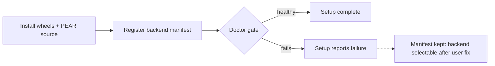

# Task 0029: Decouple PEAR backend registration from install-time health

**Status:** done
**Created:** 2026-07-16
**Owner:** alexandremendoncaalvaro
**Execution:** AFK
**Spec ref:**
**Board ref:** issue #49

## Context

Investigation of issue #49 (RTX 5090) surfaced a second, structural defect
beyond the known Torch/Blackwell gap. In `install_pear.ps1`, the
"Register PEAR pose backend" step (writes `backends\pear\backend.json`) runs
AFTER "Verify install (doctor)", and any doctor error other than missing
licensed assets aborts the handler. Consequence: on a machine where the
install-time doctor fails — an RTX 5090 on the pinned Torch, exactly issue
#49 — the PEAR backend is never registered, so Blender never offers it.

The reporter (Njaecha) then hand-built a Blackwell-capable runtime (Torch
nightly cu128 + PyTorch3D from source) inside the installed venv; Doctor now
passes and reports `sm_120` supported — but PEAR still does not appear in
Blender, because registration never happened and nothing installed can
create it after the fact. The official remediation ("PoseCap Setup (repair)")
would destroy the fix: the PEAR handler recreates the venv (`uv venv --clear`)
and reinstalls the pinned Torch. The user is locked out by design.

The addon-side registry (`backend_registry.py`) already validates each
manifest on every read (absolute existing executable, schema, duplicate ids)
and surfaces per-backend issues in the panel, so registration does not need
to certify runtime health to keep the UI honest.

## Acceptance Criteria

Verifiable conditions. Each as a checkbox so progress is point-editable.

- [x] A machine whose PEAR runtime fails the install-time doctor for a
      non-asset reason (e.g. unsupported GPU architecture) still ends the
      install with `backends\pear\backend.json` present, so a later
      user-fixed or PoseCap-updated runtime becomes selectable in Blender
      without reinstalling.
- [x] A user starting capture on a still-broken PEAR runtime gets the clear
      doctor-grade diagnostic (not an opaque process exit) — the health gate
      moves to where health is actually consumed, it does not disappear.
- [x] Repair keeps preserving a healthy runtime (the existing same-version
      short-circuit) and never silently downgrades a user-modified venv
      without saying so.
- [x] Regression tests pin the new contract at the level the installer tests
      already exercise (`tests/test_installer_components.py`).
- [x] Issue #49 is updated with the outcome and the interim manual
      registration steps for the reporter.

## Decision — shape A (register on component presence)

Three shapes were weighed; A is decided because B and C both fail the first
acceptance criterion's intent (the broken-runtime lockout would remain the
default experience) — an elimination by the criteria, not a taste call. The
maintainer's veto stands at PR review as usual.

- **A (decided) — register on component presence.** Write the backend
  manifest as soon as the PEAR component's files exist, before the doctor
  step. Registration means "installed", health means "healthy" — two
  different questions answered in two places. Pro: unblocks self-fixed
  runtimes and future runtime updates; simplest change. Con: a user with a
  broken runtime sees a selectable PEAR that fails at Start Stream — but
  with the v1.0.6 doctor-grade message, no longer an opaque crash.
- **B — a "register backend" repair sub-action** that writes the manifest
  without touching the venv. Pro: keeps the current gate; Con: new installer
  surface for a flow users must discover; the lockout stays the default.
- **C — Doctor self-heals registration** when it passes on an installed
  tree. Pro: "doctor approves = available" is intuitive; Con: gives a
  diagnostic tool write side effects, and the broken-runtime lockout stays.

## Notes

### 2026-07-16 — finding recorded from issue #49 investigation

Evidence chain: `install_pear.ps1` step order (doctor at line ~201, register
at ~226, `$ErrorActionPreference = "Stop"`); a healthy installation carries
`backends\pear\backend.json` while the reporter's Doctor-passing machine
still lists no PEAR backend in Blender; the repair path recreates the venv
from the pinned locks. Falsification asked of the reporter on the issue:
confirm `%LOCALAPPDATA%\PoseCap\backends\pear\backend.json` is absent.

### 2026-07-16 — shape A implemented

The "Register PEAR pose backend" step moved from after the doctor gate to
right after the bundled-wheels install: at that point the engine executable
and PEAR source exist, so registration ("component installed") no longer
waits on health ("runtime works here"). A doctor failure still fails the
setup run, but the manifest survives it, so a user-fixed or updated runtime
becomes selectable without reinstalling. Criterion 2 needed no new code —
verified in the addon: `engine_process.py` surfaces the engine's stderr
("engine exited before announcing stream endpoint: ...") and the engine CLI
emits the doctor-grade startup diagnostic on a broken runtime. Criterion 3:
the venv-create step now announces "replacing the existing engine runtime
with the pinned versions" before `uv venv --clear` when a venv already
exists; the same-version healthy-repair short-circuit is untouched. Tests:
static order pin (registration before doctor), replace-announcement pin, and
the superseded "registers only after doctor" pin updated to the new contract.

### 2026-07-16 — task closed

Fix merged to `main` via PR #76 (squash, green `CI required`, two-axis
fresh-context review with no blockers). Issue #49 answered with the outcome
and the repair caveat; the interim manual `backend.json` steps were already
in the thread. The fix reaches end users with the next installer build
(win.N bump, release is HITL); RTX 50 support itself stays tracked in issue
#49, which remains open by design.

## Definition of Done

All Acceptance Criteria checked, plus:

- [x] Local tests pass (or N/A documented in Notes)
- [x] Code review completed (human or fresh-context reviewer per WORKFLOW §10)
- [x] No orphan `TODO`/`FIXME` introduced
- [x] Status updated to `done` and Notes log closes the task
