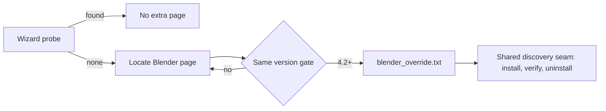

# Task 0030: Offer a manual Blender path in the installer

**Status:** in-progress
**Created:** 2026-07-16
**Owner:** alexandremendoncaalvaro
**Execution:** AFK
**Spec ref:**
**Board ref:** issue #48

## Context

Issue #48's reporter suggested it directly: when automatic Blender discovery
fails (portable builds, unusual install roots, future store fronts we have
not enumerated), the installer's only answer today is "Install Blender 4.2 or
newer" — even when a perfectly good Blender exists somewhere we did not look.
Steam discovery (PR #51) fixed the largest known gap, but discovery by
enumeration can never be exhaustive. A manual path input is the escape hatch
that keeps every future "installer cannot find my Blender" report solvable by
the user in one step, and it follows the project's CK2P parametrization
principle: simple automatic default, expandable manual override.

## Acceptance Criteria

Verifiable conditions. Each as a checkbox so progress is point-editable.

- [x] When automatic discovery finds no compatible Blender, the installer
      offers the user a way to provide the path to their `blender.exe`
      instead of failing outright.
- [x] A provided path is validated the same way discovered ones are (version
      4.2 or newer, executable exists) with an actionable message when it
      does not qualify.
- [x] The chosen path is honored by install, verify, and uninstall (the same
      shared discovery seam PR #51 introduced), not just by the first step.
- [x] Automatic discovery remains the default; a user who never needs the
      override never sees extra friction.
- [x] Regression tests cover the override at the level the installer tests
      already exercise (`tests/test_installer_components.py`).

## Notes

### 2026-07-16 — origin

Suggested by the issue #48 reporter after working around discovery with a
manual `PATH` edit. Recorded during the open-bug triage; not scheduled yet —
priority queue at the time: task 0028 (installer stderr), task 0029 (backend
registration), then this.

### 2026-07-16 — implemented

The manual path is candidate input to the existing shared discovery seam,
not a parallel mechanism. `Find-CompatibleBlenders` gains `-InstallDir` and
reads `{app}\blender_override.txt`; a compatible override outranks
discovered installs (the user picked it deliberately), an invalid or stale
one falls through to automatic discovery, and every candidate passes the
same version gate (`Get-BlenderVersion`, factored out of the discovery
loop). Install, verify, and uninstall all call the seam, so the override is
honored everywhere by construction.

Wizard side (Inno `[Code]`): a "Locate Blender" file page after the
components page, shown only when a hidden wizard-time probe
(`probe_blender.ps1`, sharing the same discovery library) finds no Blender —
the no-override user never sees it. The picked file is validated by the same
probe before Next proceeds, with an actionable message naming a concrete
example path. The choice lands in `{app}\blender_override.txt` at
post-install, is honored by the repair shortcut (same bootstrap), and is
removed on uninstall.

### 2026-07-16 — fresh-context review findings resolved

Two-axis review raised one shared blocker and four concerns. The blocker
(`ExtractTemporaryFile` allegedly requires `dontcopy`-flagged `[Files]`
entries and would crash every wizard run under `SolidCompression=yes`) was
refuted empirically, not argued: a minimal installer compiled with ISCC 6
using this template's exact flags (solid LZMA2, script staged only via a
wildcard entry, no `dontcopy`) extracted and read the file inside
`InitializeWizard` — including under `/VERYSILENT`. The template stays as
designed. The real findings, all fixed: a zero-byte `blender_override.txt`
crashed discovery (`Get-Content -Raw` returns null in PowerShell 5.1 —
null-guarded, pinned by test); `Get-BlenderVersion` threw on an empty-string
path (guarded); the wizard probe now passes `-InstallDir` so a returning
user with a still-valid override is not asked to browse again; the override
file is written as UTF-8 with BOM (`SaveStringsToUTF8File`) so non-ASCII
paths survive the wizard-to-PowerShell round trip; and the
override-outranks-discovered precedence claim is now pinned by a test with
both a valid override and a discovered Blender present.

## Definition of Done

All Acceptance Criteria checked, plus:

- [ ] Local tests pass (or N/A documented in Notes)
- [ ] Code review completed (human or fresh-context reviewer per WORKFLOW §10)
- [ ] No orphan `TODO`/`FIXME` introduced
- [ ] Status updated to `done` and Notes log closes the task
